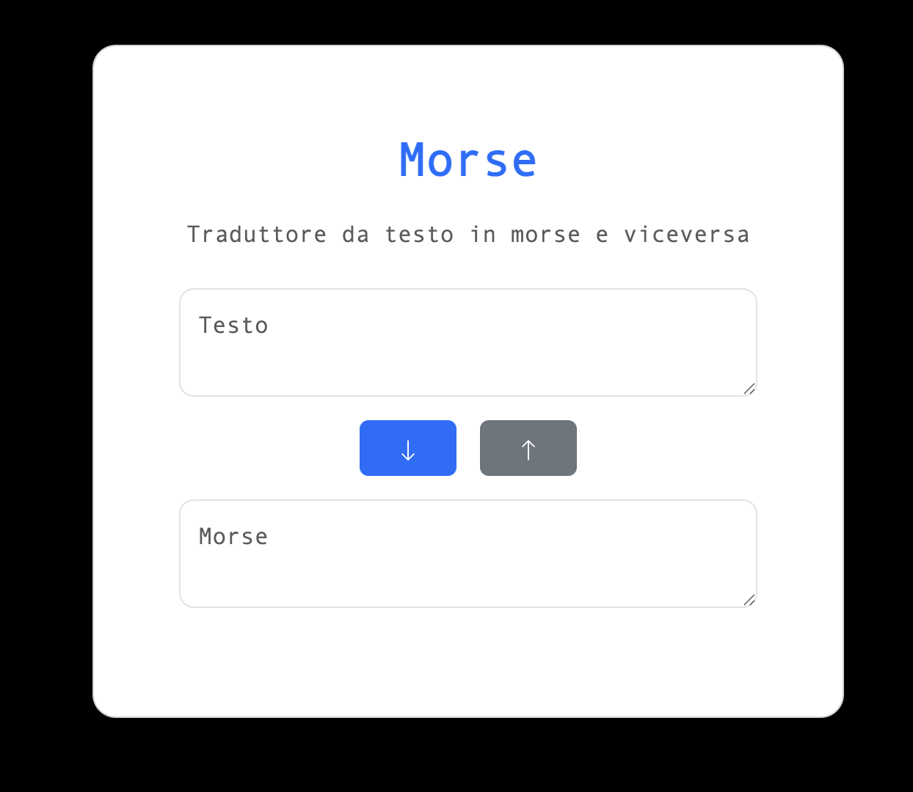
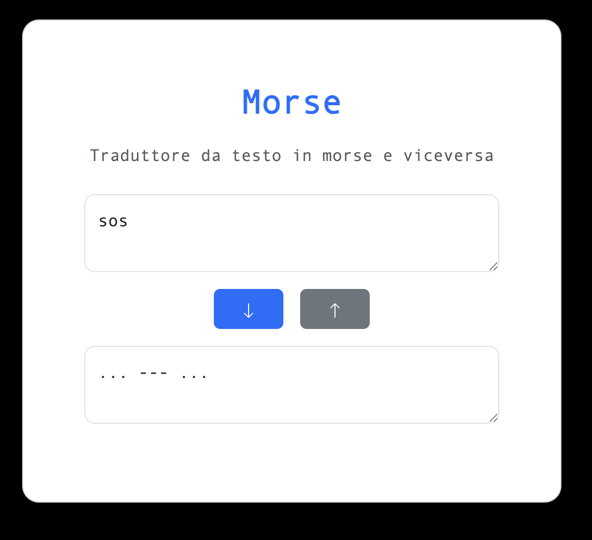
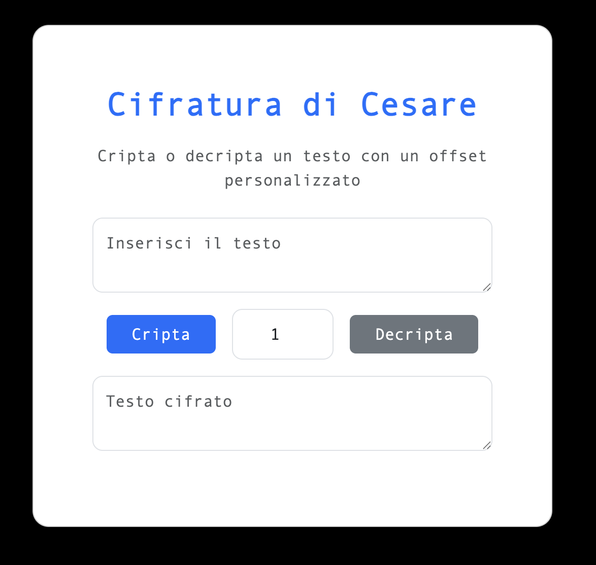
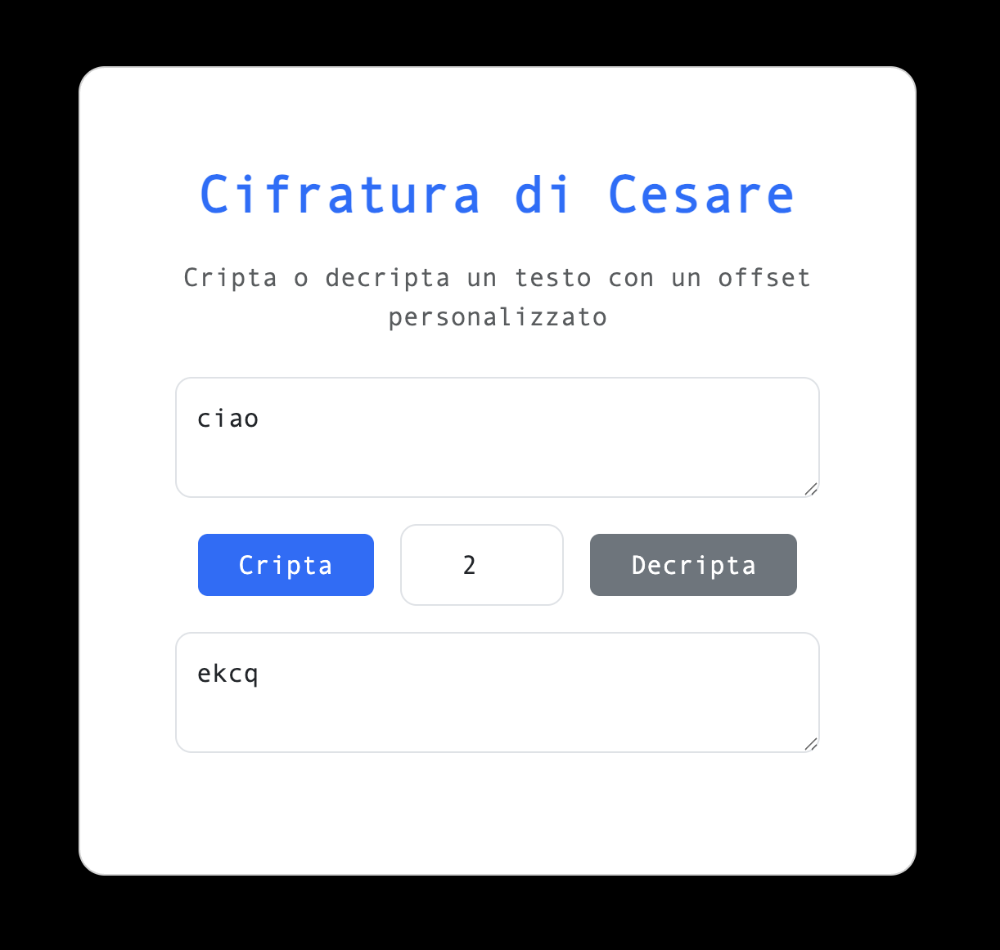

# PhpProjects

## Forma
> La pagina permette di inserire un valore *n* e di selezionare
forma tra le quattro disponibili (triangolo, quadrato, triangolo
rovesciato e cornice)

  

> una volta premuto il tasto **Disegna** il risultato viene mostrato
tramite un'altra pagina

  

-----------------------

## PrimeNumbers

> La pagina permette di inserire un intervallo [A, B] e restituire
i numeri primi contenuti nello stesso.

  

> Una volta premuto il tasto **Calcola** il risultato viene mostrato
tramite un'altra pagina

  

------

## TextToMorse
> La pagina permette di converire un testo in codice morse e viceversa.

  

> Una volta premuta la freccia corrispondente al verso di conversione,
> il risultato viene mostrato nella medesima pagina.

  

----

## Cifrario Di Cesare 
> La pagina permette di utilizzare la cifratura di cesare inserendo un
> offset sottoforma di numero.

  

> Una volta premuto il bottone "Cripta" o "Decripta" il testo verra
> mostrato nella medesima pagina.

  

---